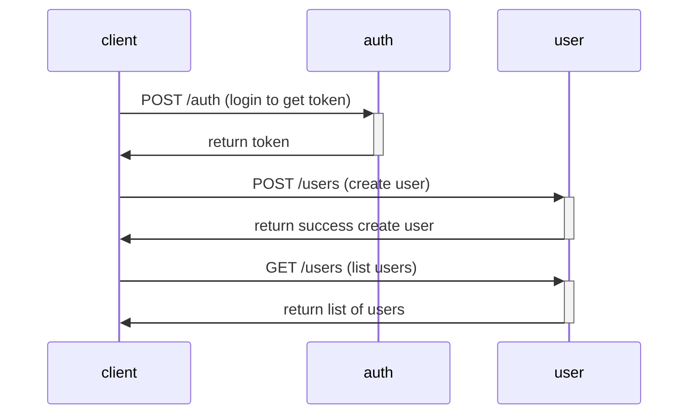
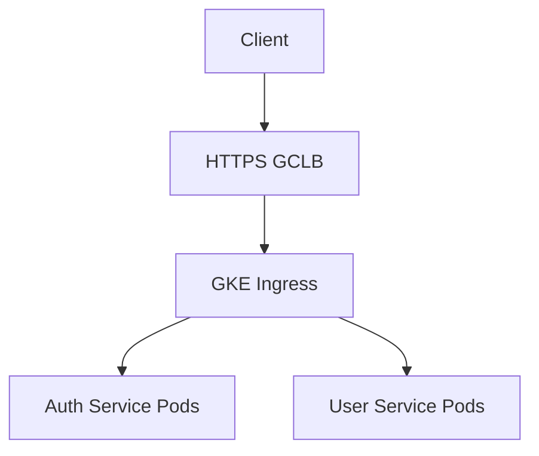

# Architecture Diagram

List of architecture diagrams.

## Sequence Diagram

## Service Architecture Diagram

If we utilize Terraform scripts provided in this project and trigger the deployment to GKE cluster using also Kubernetes manifests provided in this project, the service architecture diagram of the services deployed on GKE could be seen like below.

